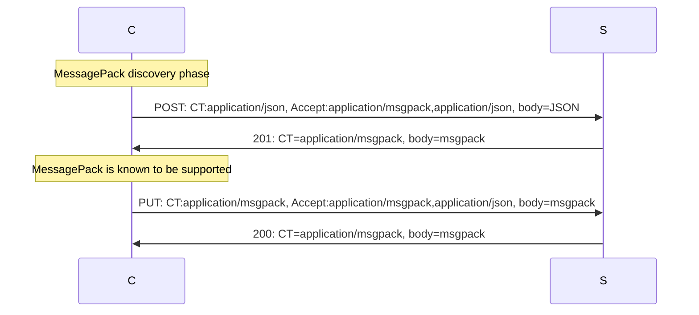

# RESTful Client

## Introduction

Client class is designed to send HTTP requests and receive their responses.
Similar to `http.Client` class, with the difference of strong data structure support.
Performs Marshal/Unmarshal automatically to send/receive JSON (or MessagePack).

Functions often have a context parameter. That is used for generic purposes, such as canceling a request or defining a timeout.
Furthermore, RESTful's Server and Lambda class may add tracing information which is then propagated by this client.

## SendRecv

`SendRecv` function is at the heart of the client. It expects structures for data to be sent and received.

`SendRecv2xx` is its friend. It is almost the same. But returns an error even if a response is received, but not 200-299.
`Get`, `Post` and other functions are built on top of it.

## POST, GET, PUT, and DELETE

```go
type user struct{
    Name    string `json:"name,omitempty"`
    Address string `json:"addr,omitempty"`
}

client := restful.NewClient().Root("https://example.com") /* Setting API root is optional, may avoid passing config around. */
client.Timeout(5 * time.Second).Retry(3, time.Second, 5*time.Second)

joe := user{Name: "Joe", Address: "Karakaari 7, 02610 Espoo, Suomi"}
location, err := client.Post(ctx, "/user", &joe, nil /*no answer expected*/)
if err != nil {
    panic(err)
}

err = client.Get(ctx, location, &joe)
if err != nil {
    panic(err)
}

joe.Name = "Joe Smith"
_, err := client.Put(ctx, location, &joe, nil /*no answer expected*/)
if err != nil {
    panic(err)
}

err = client.Delete(location)
if err != nil {
    if restful.GetErrStatusCode(err) == http.StatusNotFound {
        panic("The user I've just created is not found. This is crazy.")
    }
    panic(err)
}
```

## HTTPS

### Check URL

It is possible to disable cleartext HTTP entirely or enable it toward certain targets only.

```go
clientNoHTTP := restful.NewClient().HTTPS(nil)
clientNoHTTPUnlessTest := restful.NewClient().HTTPS(&HTTPSConfig{AllowedHTTPHosts: []string{"test.server"}})
clientNoHTTPUnlessLocal := restful.NewClient().HTTPS(&HTTPSConfig{AllowLocalhostHTTP: true})
```

It is up to the design paradigm whether to allow cleartext traffic for non-test targets.
According to the service mesh pattern, transport issues, including encryption algorithms, do not belong to the business logic.

### OS cert pool

HTTPS works out of the box. Certs are loaded from the OS cert pool without further ado.

```go
client := restful.NewClient()
```

### Own set of CA certs

Load CA certs from a directory. Looks for `*.crt` and `*.pem` files.
That is often needed when a private CA is used.

```go
client := restful.NewClient().TLSRootCerts("/etc/cacerts", false)
```

### Mutual TLS

When Mutual TLS is used, the server authenticates the client, too.
Most of the time the client certificate is signed by a private CA that is known to the server.

Load CA certs and load own `tls.key` and `tls.crt` files.
File naming follows Kubernetes TLS secret solution, e.g., used at `kubectl create secret tls` command.
You may use further options to define file directories and names.

```go
client := restful.NewClient()
client.TLSRootCerts("/etc/cacerts", false)
client.TLSOwnCerts("/etc/own_tls")
```

❗ Note that once the client loaded the key + cert, it is in the memory.
Any update (e.g., cert-manager.io) will not affect that client.
You may restart your app, e.g. issue `kubectl rollout restart deploy xxx` when using K8s.

## MessagePack

MessagePack is substantially cheaper to parse compared to JSON.
Otherwise equivalent.
If `client.MsgPack(true)` is called, the client discovers if the server supports MessagePack.



Warning! MessagePack (msgpack) is EXPERIMENTAL. As does not seem to deliver the anticipated performance boost, it is DEPRECATED. It will be removed in the near-future.

## Broadcast goodies

* `BroadcastRequest` sends a request to all IP addresses resolved for the given target URL, such as of Kubernetes headless service. Expects 2xx responses for all.
* `SendRecvResolveFirst2xxSequential` and `SendRecvResolveFirst2xxParallel` are similar to the previous one, but the first 2xx answer satisfies them. Returns data of the first positive response. Sequential and parallel variants send requests one-by-one or all at the same time.
* `SendRecvListFirst2xxSequential` and `SendRecvListFirst2xxParallel` are similar to the previous one, but target URLs are defined as a list.
* `PingList` pings a list of URLs. Expects 2xx responses for all. No request body sent or received.
